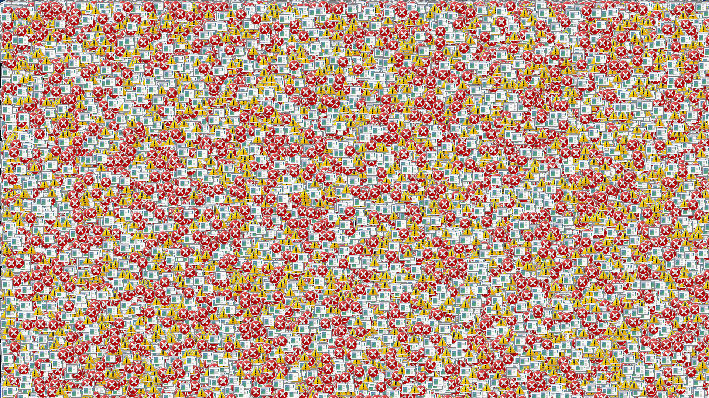
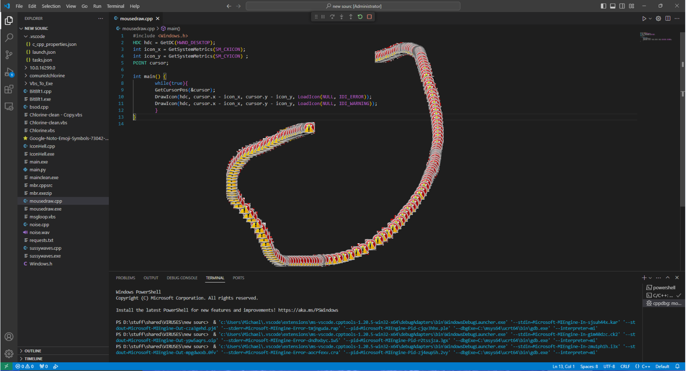
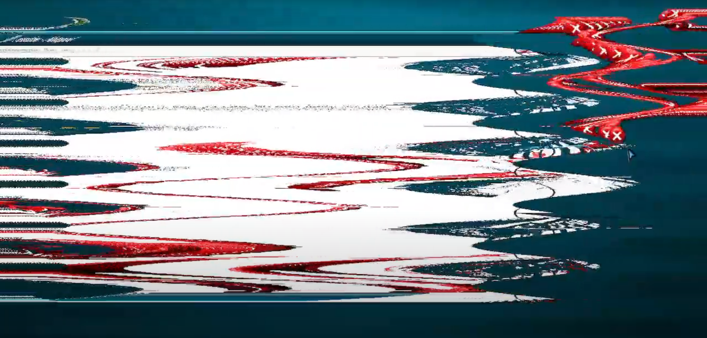

# C++

Now this is where the fun is!
Here is a list of the files and a short discription of what they do

# BitBlt1.cpp
This is the main payload of chlorine it rapidly flashes the screen like its broken! The speed depends on the speed of you CPU

.png)

.png)

.png)

# IconHell.cpp 
Running this file draws alot of icons on the screen. this is executed just befor the end of the malware.

# beep.cpp
beeps the pc speaker and spawns 2 msg boxes. runs with iconhell

# bsod.cpp

I think you know what this thing dose...   i hope...

# mbr.cpp
WARNING DO NOT RUN THIS ON A HOST COMPUTER!
This will overwrite the master boot record on the primary storage drive (C:) (Or. The drive windows is installed on) Preventing it from booting the os again, It dose this VERY SILENTLY! You wont even know when it executed

# mousedraw.cpp 
Running this will spawn error icons on the mouses path!

# noise.cpp
Running this will play the file "noise.wav" in the same directory as noise.cpp

# sussywaves.cpp
This makes some cool waves on the screen! it is the secondary payload to chlorine, it runs 20 seconds prior to BitBlt1.cpp
Some computers have different results, some make it scan down the screen slowly, and some really mess up the screen but just waving it back and forth
like this

