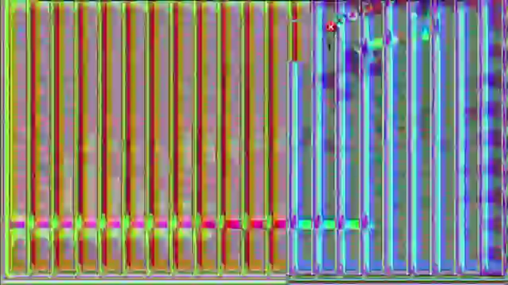

# Chlorine 3.0.EXE

A cool virus me and my friend made!
He lost access to his github account so we decided to put it here
This repository contains both the clean version and the destructive version. 

# Features
(destructive)
MBR.exe runs as soon as the virus is cleared to run (Chlorine will show a message box before preceeding)

Discord webhook Iplogger! It will run this the same time mbr runs, see main.py for the logger src

Microsoft Defender evasion. This version is undetectable! (almost ready)

# Features (clean)
Same as the destructive but with out mbr.exe (So you can use your computer again)

# Payload lists
1. MBR.exe and webhook iplogger      (main.exe mbr.exe)
2. keylogger (to be added)
3. jumbled text message box          (msgbox.vbs)
4. loud staic noise                  (noise.exe)   
5. The mouse draws error icons       (mousedraw.exe)
6. The screen draws waves!           (sussywaves.exe)
7. SEIZURE WARNING! Bright colorful lights flicker like the screen is going to break (70 seconds) (bitblt.exe)
8. Icons Spawn everywhere while in the view of the paused flickering
9. Bsod.exe (i hope you know what that dose) (bsod.exe)

# Building
Each executable will have the cpp source in the folder new sourc

The payload sequence is the vbs script for the version you want. Compile the source using vbs to exe
Adding all the files in new sourc to the embed in vbs to exe
for cpp stuff use g++

# Disclaimer and warning

The file Chlorine 3.0.exe WILL Overwrite the first 5mb of your harddrive. After you press yes. 
The file Chlroine 3.0-clean.exe Will Not overwrite the 5mb of your harddrive. after you press yes.
The clean version is harmless. it will not deal permenant damage to your operatibg system
# Creators not response able for the damage done by chlorine 3.0.exe or any source code that is destructive
